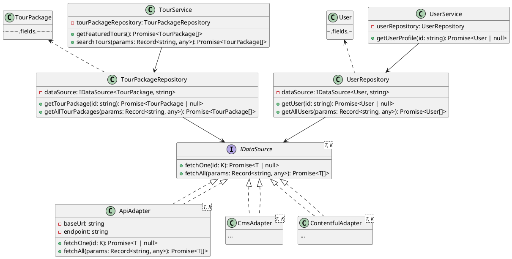

# Data Fetching Directory

This directory contains all logic and abstractions related to fetching data for the application. It is organized to support different data sources and to keep the code modular and maintainable.

## Structure Overview

- **adapters/**
  - Contains implementations for fetching data from various sources (e.g., REST APIs, CMS, Contentful).
  - Each adapter implements the `IDataSource` interface, providing a consistent way to fetch data regardless of the backend.
  - Example: `api-adapter.ts` fetches data from a REST API.

- **interfaces/**
  - Contains TypeScript interfaces that define contracts for data sources and other abstractions.
  - Example: `i-data-source.ts` defines the methods that all data source adapters must implement.

- **models/**
  - Contains TypeScript models representing the shape of data entities (e.g., TourPackage, User, etc.).

- **repositories/**
  - Contains repository classes that act as a bridge between the data source adapters and the rest of the application.
  - Repositories use adapters to fetch data and may contain additional business logic or data transformation.

- **services/**
  - Contains service classes for higher-level business logic, often orchestrating multiple repositories or data sources.

- **index.ts**
  - Entry point for the data-fetching module. Typically exports commonly used adapters, repositories, or services for easy import elsewhere in the app.

[](https://editor.plantuml.com/uml/jPNFQkCm4CRl1h_3t3PB4p-02Q6XfL3AigL_JgK7rHedOcN9QEH2QVVTLugTHBATa2xjnPYPqUZxvYVBvsIPiKqbqoHDVi2ricXALY2bYTY-m_Kbi-nUDwR0-SCKRXRmdYO0PoNQOlrRuKJm76v-vd1hT2N85S47g4RAnRviAUMaPePLbCCT5jhmELaZr6eAJBqjmiLFpsxTtrRGahFQoN1o2ic8O5cBBjGf4LKjiK9bwP3CsGiZV3GoXtR3JGmLhxLp60Q_sq_huAAYpph8iYnie1qOPSj6_cyVFzXVcgFSZVN1rTwouWzRuQwq52WvnNi_4fe31PuLXqeRT0_V6nY1GkJ8sntliDOah3O2n_RTfTywR7pd8OyDxTTCEtejbnNQ8BU1sAP3687HaAbRwuW6MJgLxdv9pDcFwcHFldXWnWV7NMmm3ENxyAcwVUrMS83E193w0E_Hl8eYXjV5Edjs36S-Jdch-mgPRGnoNqIJ8vDrvOJC5EksyWlmnEAR25ZU0nX2SSrB8G-Si9XDF5tg9ZZyD2IpGYjQYzgDDpWPCF_8ik3M6qdkBvInPF-oy1kEVtMpsI8yasdIEy63VCZV9mzW3YVjo_fpZVJ0t8a-qcYJ7tOuT_Uv-udz0m00)

## How to Use

- To fetch data from a specific source, use the appropriate adapter (e.g., `ApiAdapter` for REST APIs).
- To interact with data in a more abstracted way, use the repository classes.
- Services can be used for more complex operations that require combining data from multiple sources or repositories.

## Extending
- To add a new data source, create a new adapter in the `adapters/` folder and implement the `IDataSource` interface.
- Add new models as needed in the `models/` folder.
- Add or update repositories and services as your data-fetching needs grow.

---
This structure helps keep data-fetching logic organized, testable, and easy to extend as your application evolves.

# UML Diagram for Data Fetching Layer

Below is a comprehensive UML class diagram (in PlantUML format) representing the main abstractions and relationships in the `data-fetching` directory, including adapters, interfaces, models, repositories, and services. Copy this into any PlantUML viewer to visualize it.

## How to Use
- Paste the above code into a PlantUML editor (e.g., https://plantuml.com/ or VS Code PlantUML extension) to view the diagram.
- This diagram shows the core interface (`IDataSource`), its main implementations (adapters), sample models, repositories, and services, as well as their relationships.

---
Feel free to update this diagram as you add more adapters, models, repositories, or services!
